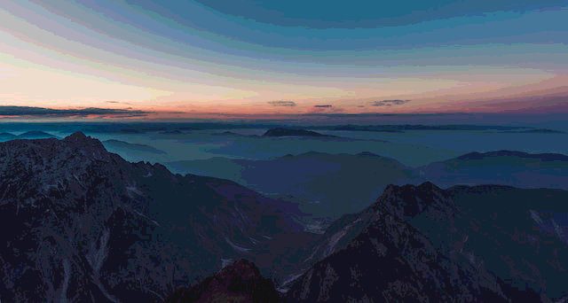
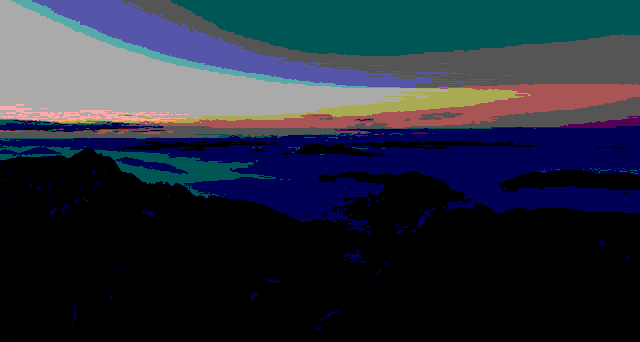

# C++ Low-Level BMP Image Processing Toolkit

## Overview
This repository contains a collection of high-performance, lightweight C++ tools designed for manipulating uncompressed BMP (Bitmap) images directly at the byte level.

Unlike high-level libraries (e.g., OpenCV) that abstract away the underlying data structures, this project implements image processing algorithms **from scratch**. It demonstrates direct manipulation of file headers (`BMPFileHeader`, `BMPInfoHeader`) and pixel data buffering, focusing on memory alignment and binary I/O efficiency.

## Features

### 1. Color Quantization & Bit-Depth Reduction
Reduces the color resolution of images using custom quantization algorithms. This module handles channel-wise pixel intensity mapping to simulate lower bit-depth environments.
* **Supported Depths:** 6-bit, 4-bit, and 2-bit quantization per channel.
* **Technique:** Linear mapping factor calculation based on bitwise shifting.

### 2. Geometric Transformation (Horizontal Flip)
Performs memory-efficient geometric transformations.
* **Function:** Mirrors the image horizontally.
* **Implementation:** Swaps pixel bytes in-place using pointer arithmetic to ensure minimal memory overhead.

### 3. Region of Interest (ROI) Cropping
Extracts specific sub-regions from high-resolution images.
* **Function:** Crops an image based on defined `(x, y)` coordinates and dimensions.
* **Implementation:** Reconstructs BMP headers dynamically to match the new dimensions and calculates row padding (4-byte alignment) to ensure valid output files.

## Technical Stack
* **Language:** C++ (Standard STL, no external image processing libraries)
* **Input Format:** 24-bit / 32-bit Uncompressed BMP
* **Concepts:** Binary File I/O, Struct Alignment (`#pragma pack`), Memory Management, Pointer Arithmetic.

## Build & Usage

### Prerequisites
* G++ Compiler (MinGW for Windows or GCC for Linux)
* VS Code (Recommended)

### Compilation
You can compile the modules individually using `g++`.

**1. Flip Tool:**
```bash
g++ -o bmp_flip flip_horizontally.cpp
./bmp_flip
```
**2. Quantization Tool:**
```bash
g++ -o bmp_quantize Quantization_Resolution.cpp
./bmp_quantize
```
**3. Cropping Tool:**
```bash
g++ -o bmp_crop Image_cropping.cpp
./bmp_crop
```
### Results
Below are the demonstrations of the processing algorithms applied to sample images.

#### Color Quantization Results
Comparison between original and quantized outputs (6-bit, 4-bit, 2-bit).
| Original | 6-Bit Quantization |
| :---: | :---: |
|  |  |
| **4-Bit Quantization** | **2-Bit Quantization** |
|  |  |

| Original | 6-Bit Quantization |
| :---: | :---: |
|  |  |
| **4-Bit Quantization** | **2-Bit Quantization** |
|  |  |

#### Cropping & Flipping
| Original | Cropped Region | Horizontally Flipped |
| :---: | :---: | :---: |
|  |  |  |

| Original | Cropped Region | Horizontally Flipped |
| :---: | :---: | :---: |
|  |  |  |